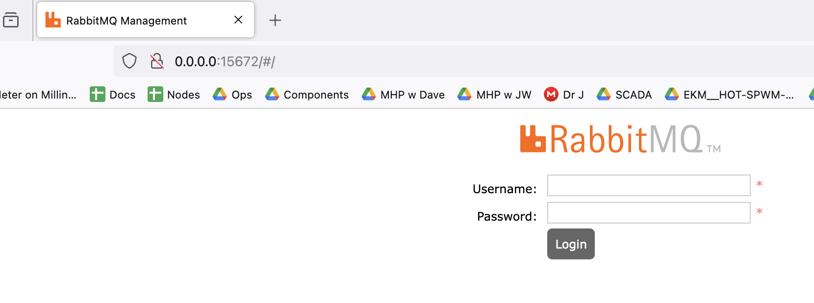

# Gridworks Base

[][pypi_]
[][status]
[][python version]
[][license]

[][read the docs]
[][tests]
[][codecov]

[][pre-commit]
[][black]

[pypi_]: https://pypi.org/project/gridworks-base/
[status]: https://pypi.org/project/gridworks-base/
[python version]: https://pypi.org/project/gridworks-base
[read the docs]: https://gridworks-base.readthedocs.io/
[tests]: https://github.com/thegridelectric/gridworks-base/actions?workflow=Tests
[codecov]: https://app.codecov.io/gh/thegridelectric/gridworks-base
[pre-commit]: https://github.com/pre-commit/pre-commit
[black]: https://github.com/psf/black

This repository serves two purposes:

1. it provides the base class for the default GridWorks actor using pika, the main python package for interacting with RabbitMQ

   - install the `gwbase` package via

   ```
   $ pip install gridworks-base
   ```

2. It provides scripts for runnig a local dev rabbit broker, which is the recommended way to develop.

## Dev Rabbit Broker

All GridWorks repos require a running rabbitMQ dev broker running to pass tests or run dev simulations. Instructions for setting it up:

- Make sure you have [docker](https://www.docker.com/products/docker-desktop/) installed
- Know whether your computer architecture is x86 or arm
- Start the dev broker in a docker container:
  - **x86 architecture**: `./x86.sh`
  - **arm architecture**: `./arm.sh`

Tests for success:

1. go to http://0.0.0.0:15672/ - it should look like this:

 - Username/password for the dev rabbit broker: `smqPublic/smqPublic` - [More info]](https://gridworks.readthedocs.io/en/latest/gridworks-broker.html) on the GridWorks use of rabbit brokers

2. tests pass

```
poetry install
poetry shell
pytest -v
```

This, and most other GridWorks repositories, use poetry installed via pipx to handle package management. They are also kicked off via [Cookiecutter](https://cookiecutter-hypermodern-python.readthedocs.io/en/2022.6.3.post1/quickstart.html), which also sets up a template for continuous integration in github actions, package publishing on pypi as well as documentation at pypi.

TODO: EXPLAIN MORE ABOUT CI, BLACK, NOX, DEPENDABOT. A MORE LINKS TO WHY THIS STUFF IS IMPORTANT IN A PRODUCTION SYSTEM.

## Hello Rabbit

Quick start for seeing how the actor base can send a message on the rabbit broker. Run hello_rabbit.py (after starting up the dev rabbit broker, see [dev broker](dev-rabbit-broker) above) and look at the `src/gwbase/actor_base.py` code.

TODO: explain more about what this code does. Links to the type registroy, code generation.
TODO: create a second hello script with two actors sending heartbeats back and forth.

Distributed under the terms of the [MIT license][license],
_Gridworks Base_ is free and open source software.

## Credits

This project was generated from [@cjolowicz]'s [Hypermodern Python Cookiecutter] template.

[@cjolowicz]: https://github.com/cjolowicz
[pypi]: https://pypi.org/
[hypermodern python cookiecutter]: https://github.com/cjolowicz/cookiecutter-hypermodern-python
[file an issue]: https://github.com/thegridelectric/gridworks-base/issues
[pip]: https://pip.pypa.io/

<!-- github-only -->

[license]: https://github.com/thegridelectric/gridworks-base/blob/main/LICENSE
[contributor guide]: https://github.com/thegridelectric/gridworks-base/blob/main/CONTRIBUTING.md
[command-line reference]: https://gridworks-base.readthedocs.io/en/latest/usage.html
