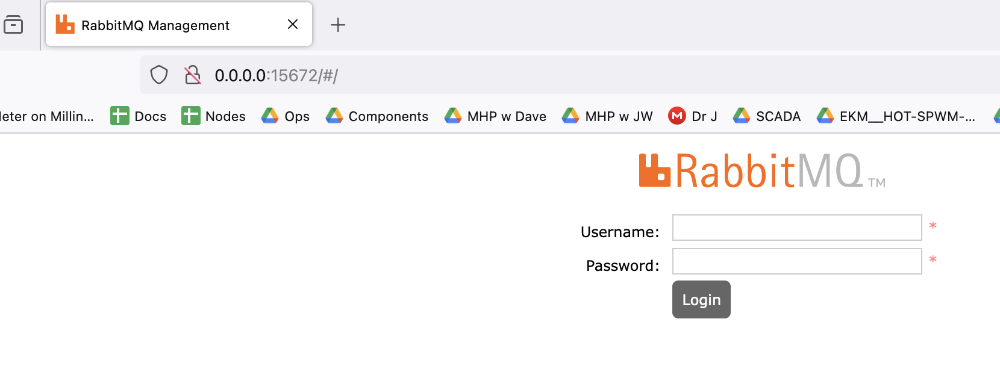

# GridWorks Base

[][pypi_]
[][status]
[][python version]
[][license]

[][tests]
[][codecov]

[][pre-commit]
[][black]

[pypi_]: https://pypi.org/project/gridworks-base/
[status]: https://pypi.org/project/gridworks-base/
[python version]: https://pypi.org/project/gridworks-base
[tests]: https://github.com/thegridelectric/gridworks-base/actions?workflow=Tests
[codecov]: https://app.codecov.io/gh/thegridelectric/gridworks-base
[pre-commit]: https://github.com/pre-commit/pre-commit
[black]: https://github.com/psf/black

`gridworks-base` (module `gwbase`) is the **shared foundation for the
GridWorks GNode service fleet** — the RabbitMQ-transport actor framework and
the single source of truth for the broker topology. Its defining commitment
is a **strict separation between transport and codec**: the transport routes
raw bytes; the [Sema](https://github.com/thegridelectric/sema) codec encodes/decodes typed messages; the
boundary between them is one `RoutingEnvelope` + a `bytes` payload.

Services import it as a package and subclass `GridworksActor`, one per
`TransportClass` — imported today by `gridworks-ear` and
`gridworks-journalkeeper`; intended as the base for `gridworks-ltn` (`ltn`),
`gridworks-marketmaker` (`mm`), and the weather (`weather`) and price
(`price`) forecast services. The routing taxonomy for all of them lives here
in `gwbase.topology`.

This repo provides two things:

1. **The `gwbase` package** — `ActorBase` (transport), `GridworksActor`
   (adds GNode identity + the Sema codec), and `gwbase.topology` (the broker
   fabric). Install with `pip install gridworks-base`.
2. **Dev-broker scripts** — run a local RabbitMQ broker for development
   (below).

## Dev Rabbit Broker

GridWorks services that use the AMQP transport require a running RabbitMQ
dev broker to pass tests or run dev simulations. (SCADA is the exception —
it is MQTT-native, with no AMQP exchanges.) Instructions for setting it up:

- Make sure you have [docker](https://www.docker.com/products/docker-desktop/) installed
- Start the dev broker in a docker container — `./arm.sh` or `./x86.sh`
  (**identical now**: both pull the same multi-arch image
  `ghcr.io/thegridelectric/dev-rabbit`, arm64 + amd64; Docker selects your
  architecture automatically). The image bakes the generated broker
  definitions, so no extra setup is needed to get the right exchanges.

Note those scripts are just aliases so one doesn't need to remember the docker incantation. Also, if you have an older version of docker, you may need to use `docker-compose` instead of `docker compose`. That should also work.

Tests for success:

1. go to http://0.0.0.0:15672/ - it should look like this:

 - Username/password for the dev rabbit broker: `smqPublic/smqPublic` - [More info]](https://gridworks.readthedocs.io/en/latest/gridworks-broker.html) on the GridWorks use of rabbit brokers

2. Test mqtt access via mqtt_sub:

```
mosquitto_sub -h localhost -p 1885 -u smqPublic -P smqPublic -t "#" -v
```

and go to `http://0.0.0.0:15672/queues` to confirm a new queue has showed up

```
docker exec -it gw-dev-rabbit rabbitmq-plugins list
```

And confirm `rabbitmq_mqtt` and `rabbitmq_management` appear as enabled
(`[E*]`).


3. Confirm the **baked broker definitions** loaded — the exchanges and the
   `smqPublic` user come from inside the image (generated from
   `gwbase.topology`):

```
# exchanges live in the d1__1 vhost (not the default "/"):
docker exec gw-dev-rabbit rabbitmqctl list_exchanges -p d1__1 | grep -E 'ltn_tx|super_tx|ear_tx'
docker exec gw-dev-rabbit rabbitmqctl list_users   # expect smqPublic
```

4. tests pass

```
uv sync --all-groups
uv run pytest -v
```

This repository uses [uv](https://docs.astral.sh/uv/) for package and
environment management (`pyproject.toml` + `uv.lock`). Common tasks:

```
uv run pytest          # tests
uv run ruff check .    # lint
uv run ruff format .   # format
uv run mypy src        # type-check
```

`nox` sessions (`nox -s tests|lint|mypy|xdoctest|docs-build`) are an
optional convenience wrapper over the same `uv run` commands; install nox
globally (e.g. `uv tool install nox`) to use them. CI runs the `uv run`
commands directly.

## Building & publishing the dev-broker image (GHCR)

**This repo is the build-and-publish home for the GridWorks dev-broker
image.** It is published **public** on GHCR
(`ghcr.io/thegridelectric/dev-rabbit`), so any GridWorks repo — and their
CI — can `docker pull` it (or use it as a CI service container) with no auth
and no `gridworks-base` checkout. The broker fabric is baked in, so every
consumer gets the exact same exchanges/bindings.

`arm.sh` / `x86.sh` pull this prebuilt multi-arch image, which bakes the
generated broker definitions onto official RabbitMQ (`rabbit/Dockerfile`).
The definitions are generated from `gwbase.topology` (single source of
truth; a drift guard keeps the committed
`rabbit/rabbitconfig/*_definitions.json` in sync). You only rebuild/push the
image when the definitions, conf, or plugins change.

**Automatic (CI):** `.github/workflows/broker-image.yml` builds and pushes
the image on a push to `main`/`dev` that touches the baked inputs, gated by
the definitions drift check (`gen_definitions.py --check`). Usually you do
not push by hand.

**Manual (seed / local):**

```bash
# one-time: a buildx builder that can do multi-arch. The default "docker"
# driver CANNOT — it errors "Multi-platform build is not supported for the
# docker driver". Create a docker-container builder instead:
docker buildx create --name gw --driver docker-container --use
docker buildx inspect --bootstrap

# one-time: log in to GHCR with a GitHub PAT (classic) that has
# write:packages (your account needs write access to the thegridelectric org):
echo "$GHCR_PAT" | docker login ghcr.io -u <github-username> --password-stdin

# build + push (run on a clean tree so the tag is chaos__<short-sha>__<date>,
# not chaos__dev):
./rabbit/build-and-push.sh
```

After the **first** push the package is **private** — set it **Public**
(GitHub → `thegridelectric` → Packages → `dev-rabbit` → Package settings →
Change visibility) so any machine can `docker pull` without auth. Then
verify both arches are published:

```bash
docker buildx imagetools inspect ghcr.io/thegridelectric/dev-rabbit:latest
# expect: linux/amd64 and linux/arm64/v8
```

For a quick local-only test without pushing, build just your host arch:
`docker build -f rabbit/Dockerfile -t dev-rabbit-local .`

## Hello Rabbit

`hello_rabbit.py` is a two-actor demo: a tiny Supervisor pings a
`HelloGNode`, which pongs back over the dev broker. Start the dev broker
(above), then run it from the repo root:

```
uv run python hello_rabbit.py
```

Read it alongside `src/gwbase/actor_base.py` (transport) and
`src/gwbase/gridworks_actor.py` (identity + heartbeat). The message types it
sends are defined in the [Sema](https://github.com/thegridelectric/sema) codec (`src/gwbase/sema/`), which is
the registry `GridworksActor` decodes against.

Distributed under the terms of the [MIT license][license],
_Gridworks Base_ is free and open source software.

<!-- github-only -->

[license]: https://github.com/thegridelectric/gridworks-base/blob/main/LICENSE
[contributor guide]: https://github.com/thegridelectric/gridworks-base/blob/main/CONTRIBUTING.md
[command-line reference]: https://gridworks-base.readthedocs.io/en/latest/usage.html
