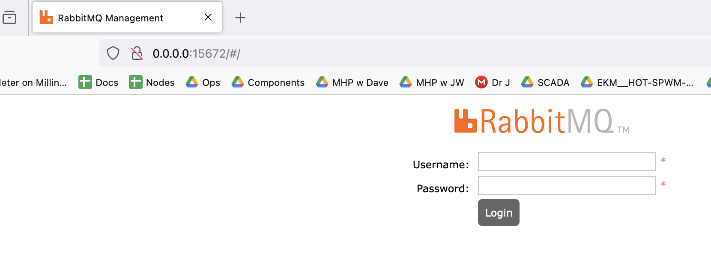

# GridWorks Base

[][pypi_]
[][status]
[][python version]
[][license]

[][tests]
[][codecov]

[pypi_]: https://pypi.org/project/gridworks-base/
[status]: https://pypi.org/project/gridworks-base/
[python version]: https://pypi.org/project/gridworks-base
[tests]: https://github.com/thegridelectric/gridworks-base/actions?workflow=Tests
[codecov]: https://app.codecov.io/gh/thegridelectric/gridworks-base

`gridworks-base` (module `gwbase`) is the **shared foundation for the
GridWorks GNode service fleet** — the RabbitMQ-transport actor framework and
the single source of truth for the broker topology. Its defining commitment
is a **strict separation between transport and codec**: the transport routes
raw bytes; the [Sema](https://github.com/thegridelectric/sema) codec encodes/decodes typed messages; the
boundary between them is one `RoutingEnvelope` + a `bytes` payload. How
sender, type, and addressing ride the routing key — and how exchanges and
bindings carry a message from one actor to another — is
[Message transport](#message-transport) below.

Services import it as a package and subclass the tier that matches what they
are: GNode services subclass `GridworksActor`; non-GNode rabbit consumers
subclass `ActorBase` directly with no GNode identity. The routing taxonomy
for all of them lives here in `gwbase.topology`.

This repo provides two things:

1. **The `gwbase` package** — a three-tier actor hierarchy
   (`ActorBase` → `Orchestrator` → `GridworksActor`) and `gwbase.topology`
   (the broker fabric). Install with `pip install gridworks-base`. See
   *Actor tiers, settings & file locations* below.
2. **Dev-broker scripts** — run a local RabbitMQ broker for development
   (below).

## How to commit changes

Commits run pre-commit hooks (lint, format, and a drift-guard verifying the
committed broker-definitions artifacts match `gwbase.topology`). To avoid
surprises at commit time:

```
uv run pre-commit run --all-files   # every hook, before you commit
./ci.sh                             # the full local gate: hooks + the test
                                    # suite (needs the dev broker running —
                                    # ./arm.sh or ./x86.sh)
```

If you changed `gwbase.topology`, regenerate the committed definitions
artifacts first (the drift-guard will otherwise refuse the commit):

```
uv run python for_docker/gen_definitions.py --write-all --dir rabbit/rabbitconfig
```

Two gotchas the hooks have caught in the wild: run one hook alone with
`uv run pre-commit run <hook-id> --all-files`; and if hooks fail with TLS
errors reaching PyPI (`invalid peer certificate`), check for a stray
`SSL_CERT_FILE` export in your shell — it replaces Python's trust bundle
process-wide.

## Dev Rabbit Broker

GridWorks services that use the AMQP transport require a running RabbitMQ
dev broker to pass tests or run dev simulations. (SCADA is the exception —
it is MQTT-native, with no AMQP exchanges of its own. It can still receive
the TimeCoordinator's broadcasts: `gwbase.topology` bridges the
TimeCoordinator publish exchange to the MQTT plugin's `amq.topic` (the
`rjb.#` broadcast tap), so an MQTT-native service subscribed to
`rjb/<tc-alias>/time/sim-timestep` receives `sim.timestep`.) Instructions
for setting it up:

- Make sure you have [docker](https://www.docker.com/products/docker-desktop/) installed
- Start the dev broker in a docker container — `./arm.sh` or `./x86.sh`
  (**identical now**: both pull the same multi-arch image
  `ghcr.io/thegridelectric/dev-rabbit`, arm64 + amd64; Docker selects your
  architecture automatically). The image bakes the generated broker
  definitions, so no extra setup is needed to get the right exchanges.

Note those scripts are just aliases so one doesn't need to remember the docker incantation. Also, if you have an older version of docker, you may need to use `docker-compose` instead of `docker compose`. That should also work.

Tests for success:

1. go to http://localhost:15672/ - it should look like this:

 - Username/password for the dev rabbit broker: `smqPublic/smqPublic` - [More info]](https://gridworks.readthedocs.io/en/latest/gridworks-broker.html) on the GridWorks use of rabbit brokers

2. Test mqtt access via mqtt_sub:

```
mosquitto_sub -h localhost -p 1885 -u smqPublic -P smqPublic -t "#" -v
```

and go to `http://localhost:15672/queues` to confirm a new queue has showed up

```
docker exec -it gw-dev-rabbit rabbitmq-plugins list
```

And confirm `rabbitmq_mqtt` and `rabbitmq_management` appear as enabled
(`[E*]`).


3. Confirm the **baked broker definitions** loaded — the exchanges and the
   `smqPublic` user come from inside the image (generated from
   `gwbase.topology`):

```
# exchanges live in the d1__1 vhost (not the default "/"):
docker exec gw-dev-rabbit rabbitmqctl list_exchanges -p d1__1 | grep -E 'ltn_tx|super_tx|ear_tx'
docker exec gw-dev-rabbit rabbitmqctl list_users   # expect smqPublic
```

4. tests pass

```
uv sync --all-groups
uv run pytest -v
```

This repository uses [uv](https://docs.astral.sh/uv/) for package and
environment management (`pyproject.toml` + `uv.lock`). Common tasks:

```
uv run pytest          # tests
uv run ruff check .    # lint
uv run ruff format .   # format
uv run mypy src        # type-check
```

`nox` sessions (`nox -s tests|lint|mypy|xdoctest|docs-build`) are an
optional convenience wrapper over the same `uv run` commands; install nox
globally (e.g. `uv tool install nox`) to use them. CI runs the `uv run`
commands directly.

### Environment gotchas (read this if a tool "can't be found" or CI formatting disagrees)

- **Always use `uv run …`.** uv resolves this project's `.venv` from `uv.lock`
  automatically — you do **not** create or activate a venv by hand.
- **Don't activate a stale venv.** If you see
  `VIRTUAL_ENV=… does not match the project environment path .venv and will be
  ignored`, an old activation is lingering (often from a previous repo
  location). Run `deactivate` or `unset VIRTUAL_ENV`, then use `uv run`.
- **pre-commit** runs on `git commit`, or manually with `pre-commit run`
  (staged) / `pre-commit run --all-files`. The hooks are **repo-based**, so
  pre-commit installs their tools in its own envs — no venv on PATH is needed
  (plain `pre-commit`, not `uv run pre-commit`).
- **ruff is pinned to ONE version in three coupled places** — the `ruff==…` dev
  dependency in `pyproject.toml`, `uv.lock`, and the `ruff-pre-commit` `rev` in
  `.pre-commit-config.yaml`. Keep all three equal, or local / pre-commit / CI
  will disagree on formatting. CI runs `uv sync --locked` then
  `uv run ruff format --check .`, so a local pass with the same lock = a CI pass.
- **Before pushing, run the CI mirror `./ci.sh`** (or at minimum *both*
  `uv run ruff check .` **and** `uv run ruff format .` — running only one misses
  the other). The ruff config sets `fix = true`, so a plain `uv run ruff check .`
  **auto-fixes and mutates files** locally — commit those fixes. CI runs
  `ruff check --no-fix` so it fails loudly instead. The pre-commit `ruff` hook
  only checks import order (`--select I`), so it does NOT catch F401/etc.; `ci.sh`
  is the real gate.

## Building & publishing the dev-broker image (GHCR)

**This repo is the build-and-publish home for the GridWorks dev-broker
image.** It is published **public** on GHCR
(`ghcr.io/thegridelectric/dev-rabbit`), so any GridWorks repo — and their
CI — can `docker pull` it (or use it as a CI service container) with no auth
and no `gridworks-base` checkout. The broker fabric is baked in, so every
consumer gets the exact same exchanges/bindings.

`arm.sh` / `x86.sh` pull this prebuilt multi-arch image, which bakes the
generated broker definitions onto official RabbitMQ (`rabbit/Dockerfile`).
The definitions are generated from `gwbase.topology` (single source of
truth; a drift guard keeps the committed
`rabbit/rabbitconfig/*_definitions.json` in sync). You only rebuild/push the
image when the definitions, conf, or plugins change.

**Automatic (CI):** `.github/workflows/broker-image.yml` builds and pushes
the image on a push to `main`/`dev` that touches the baked inputs, gated by
the definitions drift check (`gen_definitions.py --check`). Usually you do
not push by hand.

**Manual (seed / local):**

```bash
# one-time: a buildx builder that can do multi-arch. The default "docker"
# driver CANNOT — it errors "Multi-platform build is not supported for the
# docker driver". Create a docker-container builder instead:
docker buildx create --name gw --driver docker-container --use
docker buildx inspect --bootstrap

# one-time: log in to GHCR with a GitHub PAT (classic) that has
# write:packages (your account needs write access to the thegridelectric org):
echo "$GHCR_PAT" | docker login ghcr.io -u <github-username> --password-stdin

# build + push (run on a clean tree so the tag is chaos__<short-sha>__<date>,
# not chaos__dev):
./rabbit/build-and-push.sh
```

After the **first** push the package is **private** — set it **Public**
(GitHub → `thegridelectric` → Packages → `dev-rabbit` → Package settings →
Change visibility) so any machine can `docker pull` without auth. Then
verify both arches are published:

```bash
docker buildx imagetools inspect ghcr.io/thegridelectric/dev-rabbit:latest
# expect: linux/amd64 and linux/arm64/v8
```

For a quick local-only test without pushing, build just your host arch:
`docker build -f rabbit/Dockerfile -t dev-rabbit-local .`

## Hello Rabbit

`hello_rabbit.py` is a two-actor demo: a tiny Supervisor pings a
`HelloGNode`, which pongs back over the dev broker. Start the dev broker
(above), then run it from the repo root:

```
uv run python hello_rabbit.py
```

Read it alongside `src/gwbase/actor_base.py` (transport / ear-tap),
`src/gwbase/orchestrator.py` (class-routing + heartbeat / simulated time),
and `src/gwbase/gridworks_actor.py` (GNode identity). The message types it
sends are defined in the [Sema](https://github.com/thegridelectric/sema) codec (`src/gwbase/sema/`), which is
the registry `GridworksActor` decodes against.

## Message transport

Every message published on a GridWorks broker names its sender and its
[Sema](https://github.com/thegridelectric/sema) TypeName in the routing
key itself, so any consumer (or audit tap) can know *who spoke* and *what
type they claimed* without decoding the body. The transport routes raw
bytes on that key alone; decoding is the Sema codec's job. This section
covers the key grammar, the routing classes, and how exchanges and
bindings actually move a message from one actor to another.

### Routing keys

Aliases and TypeNames are dotted words, and RabbitMQ reserves the dot as
its topic separator — so within a routing-key word, dots render as dashes
(`hw1.isone.me.scada` → `hw1-isone-me-scada`); `parse_routing_key`
(`src/gwbase/transport_encoding.py`) restores them.

The first word is the message category, and it fixes the shape. `<from-rc>`
and `<to-rc>` are **routing classes** (next section):

| category | shape |
|---|---|
| `rj` (JsonDirect) | `rj.<from-alias>.<from-rc>.<type-name>.<to-rc>.<to-alias>` |
| `rjb` (JsonBroadcast) | `rjb.<from-alias>.<from-rc>.<type-name>[.<radio-channel>]` |
| `gw` (GridworksWrapped) | `gw.<from-alias>.to.<peer-name>.<type-name>` |
| `s` (Serial) | reserved |

Examples:

```
rj.hw1-isone-me-versant-keene-beech.ltn.bid.mm.hw1-isone-me-versant-keene
rjb.hw1-isone-me-versant-keene.mm.latest-price
gw.hw1-isone-me-versant-keene-beech-scada.to.ltn.power-watts
```

- The first is the beech LeafTransactiveNode sending a `bid` directly to
  its MarketMaker.
- The second is that MarketMaker broadcasting a `latest.price`; any
  subscriber may bind it.
- The third is the beech scada sending `power.watts` up to its LTN. The
  `gw` shape differs: the scada is MQTT-native and publishes the topic
  `gw/hw1-isone-me-versant-keene-beech-scada/to/ltn/power-watts`; the
  broker's [MQTT plugin](https://www.rabbitmq.com/docs/mqtt) maps topic
  slashes to routing-key dots. Its third word is the literal `to`, and the
  fourth is the publisher's *peer name* (the spaceheat short name of who
  it's talking to — a soft hint, not a closed class). A `gw` body is an
  outer envelope type (TypeName `gw` — hence the category word) carrying a
  header and a payload; the TypeName in the routing key is the **inner**
  payload's.

### Routing classes

The `<from-rc>` / `<to-rc>` tokens are the **routing class** — the closed
`RoutingClass` taxonomy in `src/gwbase/transport_encoding.py`, paired 1:1
with `TransportClass`. It is transport addressing, NOT Sema vocabulary
(`super` is not a GNode class):

| token | routing class |
|---|---|
| `ta` | TerminalAsset |
| `cn` | ConnectivityNode |
| `ltn` | LeafTransactiveNode |
| `mm` | MarketMaker |
| `scada` | Scada |
| `price` | PriceForecastService |
| `weather` | WeatherForecastService |
| `time` | TimeCoordinator |
| `super` | Supervisor |
| `gnr` | GridNodeRegistry |

This table is enforced against the enum by
`tests/test_readme_transport.py` — if they drift, the suite fails.

### How messages move — exchanges and bindings

All GridWorks exchanges are RabbitMQ
[topic exchanges](https://www.rabbitmq.com/tutorials/amqp-concepts#exchange-topic),
wired to each other with
[exchange-to-exchange bindings](https://www.rabbitmq.com/docs/e2e), all
declared in `gwbase.topology` (definitions-are-law: the broker boots them
from files; nothing is hand-declared). Each AMQP-actor routing class gets
a pair:

- **`<rc>mic_tx`** — the class *microphone*: what every actor of that
  class publishes into.
- **`<rc>_tx`** — the class consume exchange (internal): what actors of
  that class bind their queues to.

The fabric between them:

- **Direct (`rj`)**: each allowed sender→receiver edge is one binding
  `<src>mic_tx → <dst>_tx` with pattern `*.*.<src>.*.<dst>.*` — filtering
  on the two routing-class positions of the 6-word `rj` key.
- **Broadcast (`rjb`)**: not in the static fabric — a subscriber binds its
  own queue straight to the publisher's `<rc>mic_tx` with the broadcast
  key it wants.
- **MQTT seam**: scadas are MQTT-native; the MQTT plugin bridges their
  topics onto the built-in `amq.topic` exchange, and selected broadcasts
  (`time`, `gnr` — `rjb.#`) cross back so MQTT-side actors can hear them.
- **Audit taps**: every microphone (and `amq.topic`) also fans into
  `ear_tx` with `#` — the universal witness hears everything; the
  registry's pair additionally fans into `gnr_ear_tx` (the scoped seed
  slice).

A `bid`'s journey, end to end: the beech LTN publishes to `ltnmic_tx`
with the `rj.…ltn.bid.mm.…` key above. The fabric binding
`ltnmic_tx → mm_tx` (`*.*.ltn.*.mm.*`) forwards it, while
`ltnmic_tx → ear_tx` (`#`) tees the audit copy. The MarketMaker's queue,
bound to `mm_tx`, receives it, and the Sema codec decodes the `bid`. The
consumer got the message because it *subscribed*; the class tokens in the
parsed envelope are addressing metadata, not a delivery decision — see
the `MessageCategory` docstring for how much each category leans on them.

## Actor tiers, settings & file locations

An actor rides the tier that matches what it is:

- **`ActorBase`** — raw rabbit + sema toolkit; a passive *ear-tap*. Rides
  `ServiceSettings`, carries no GNode identity. For non-GNode consumers
  (audit taps and the like).
- **`Orchestrator`** — adds class-routing (a `transport_class`) plus the
  heartbeat / simulated-time rhythm. For Supervisor and TimeCoordinator,
  which are not GNodes.
- **`GridworksActor`** — adds GNode identity, loaded and Sema-validated from
  a `g.node.gt.json` file at boot. For SCADA, LTN, MarketMaker, forecast
  services.

### Settings

`ServiceSettings` is the minimum to construct any actor; `GNodeSettings`
extends it with the GNode file path. All fields read from the `GWBASE_` env
prefix (e.g. `GWBASE_SERVICE_ALIAS`, `GWBASE_RABBIT__URL`):

| Field | Meaning |
|---|---|
| `service_alias` | routable address, e.g. `d1.iso.me.scada` (required) |
| `instance_id` | per-process UUID, auto-generated each boot if unset |
| `service_name` | directory segment for file locations (e.g. `scada`) |
| `log_level` | `INFO` by default |
| `log_rotate_bytes` / `log_rotate_count` | log rotation (10 MB × 5 default) |
| `g_node_path` *(GNodeSettings)* | path to `g.node.gt.json` |

### File locations (XDG Base Directory)

gwbase follows the [XDG Base Directory](https://specifications.freedesktop.org/basedir-spec/latest/)
convention, keyed on `service_name` — no root or `/etc` needed. With the
`XDG_*_HOME` variables unset these default under `~/.config`,
`~/.local/share`, `~/.local/state`:

| Kind | Path |
|---|---|
| config | `$XDG_CONFIG_HOME/gridworks/<service_name>/` |
| `g.node.gt.json` | `$XDG_CONFIG_HOME/gridworks/<service_name>/g.node.gt.json` |
| data | `$XDG_DATA_HOME/gridworks/<service_name>/` |
| state | `$XDG_STATE_HOME/gridworks/<service_name>/` |
| **logs** | `$XDG_STATE_HOME/gridworks/<service_name>/log/<service_alias>.log` |

So on a Raspberry Pi a scada (`service_name=scada`, alias `d1.iso.me.scada`)
logs to `~/.local/state/gridworks/scada/log/d1.iso.me.scada.log`. Each actor
gets a contextualized logger writing a grep-friendly, `tail -f`-friendly line
format; a `RotatingFileHandler` caps it per `log_rotate_*`.

### Try it

From the repo root — no broker needed (this only builds an actor and writes a
log line):

```bash
uv run python - <<'PY'
from gwbase import ActorBase, ServiceSettings
from gwbase.config import paths

class Tap(ActorBase):
    def dispatch_message(self, *, envelope, body): pass

t = Tap(settings=ServiceSettings(
    service_alias="d1.test", service_name="myservice", log_level="DEBUG"))
t.logger.info("it works", extra={"answer": 42})
print(paths.log_dir("myservice") / "d1.test.log")
PY
```

Then read the log it points at:

```bash
cat ~/.local/state/gridworks/myservice/log/d1.test.log
```

Distributed under the terms of the [MIT license][license],
_Gridworks Base_ is free and open source software.

<!-- github-only -->

[license]: https://github.com/thegridelectric/gridworks-base/blob/main/LICENSE
[contributor guide]: https://github.com/thegridelectric/gridworks-base/blob/main/CONTRIBUTING.md
[command-line reference]: https://gridworks-base.readthedocs.io/en/latest/usage.html
